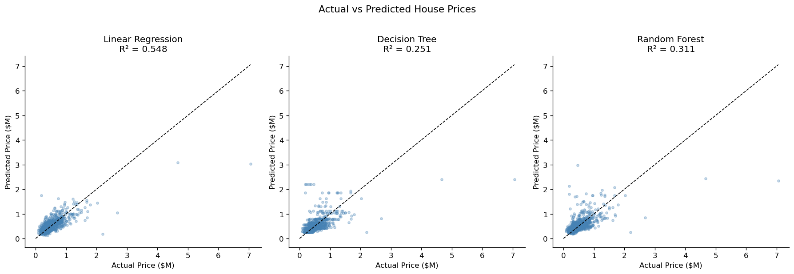

## Overview
This project develops a simple and interpretable machine learning model for predicting house prices using historical residential property data. The objective is to build a reliable model capable of estimating property values using a set of key structural features, while demonstrating a complete and well-structured end-to-end modeling workflow.

The dataset contains 4,140 housing records, with each property described by numerical attributes such as living area, number of bedrooms and bathrooms, number of floors, lot size, construction year, renovation status, waterfront status, and selected quality indicators. The target variable is the property sale price.

Multiple regression models were evaluated, including `Linear Regression`, `Decision Tree`, and `Random Forest`, using performance metrics such as Root Mean Squared Error (RMSE), Mean Absolute Error (MAE), R-squared, and 5-fold cross-validation scores, along with residual diagnostics. The project emphasises practical evaluation, interpretability, and fair model comparison.

## The Questions
1. Can house prices be predicted using a limited set of basic structural features?
2. How does a linear regression model perform compared to more complex models when those models are properly regularised?
3. What do residuals and model diagnostics reveal about prediction errors and model limitations?

## Tools I Used
This project was developed using the following tools to support analysis, modeling, and presentation:

- **Python** - the primary language used for data exploration and predictive modeling
  - **Pandas** for data manipulation, cleaning, and feature selection
  - **Matplotlib** for data visualisation and residual diagnostics
  - **NumPy** for numerical operations
  - **SciPy** for statistical diagnostics (Q-Q plot)
  - **scikit-learn** for model training, evaluation, and comparison

- **Jupyter Notebooks** - for running experiments and documenting the analysis in a clear, step-by-step manner

- **Visual Studio Code** - for writing, testing, and organizing Python scripts

- **Git & GitHub** - for version control, experiment tracking, and project sharing

## Import & Clean Up Data
The required libraries were imported and the dataset was loaded for initial inspection. Basic exploratory checks were performed to understand data structure and identify quality issues.

Two data quality issues were found and addressed:

**Zero-price records:** 49 records (1.2% of the dataset) had a sale price of $0, which are almost certainly data entry errors. These were removed before modeling to avoid distorting results.

**Missing condition values:** The `condition` column contained 545 missing entries. These were imputed using the column median - a robust strategy that preserves data while reducing the influence of outliers.

```python
# Remove zero-price records
df = df[df['price'] > 0]

# Impute missing condition values
df['condition'] = df['condition'].fillna(df['condition'].median())
```

View my notebook with detailed steps here: [house_price_prediction_improved.ipynb](house_price_prediction_improved.ipynb)

## The Analysis
The dataset was prepared for modeling by selecting all available structural features, including `waterfront` which was previously excluded. Features chosen: `living area` (sqft_living), `bedrooms`, `bathrooms`, `floors`, `condition`, `year built`, `year renovated`, `view`, and `waterfront`. The property price was used as the target variable.

```python
FEATURES = ['sqft_living', 'bedrooms', 'bathrooms', 'floors',
            'condition', 'yr_built', 'yr_renovated', 'view', 'waterfront']

X = df[FEATURES]
y = df['price']
```

The data was split into training and testing subsets using an 80/20 split with `random_state=42` for reproducibility.

```python
from sklearn.model_selection import train_test_split
X_train, X_test, y_train, y_test = train_test_split(
    X, y, test_size=0.2, random_state=42)
```

Three models were trained and compared. Critically, the Decision Tree and Random Forest were **regularised with hyperparameters** (`max_depth`, `min_samples_leaf`) to prevent overfitting - without this, default tree models massively overfit and produce misleading comparisons. All models were also evaluated using **5-fold cross-validation** alongside the test set score to detect overfitting and give a more realistic performance estimate.

```python
from sklearn.tree import DecisionTreeRegressor
from sklearn.ensemble import RandomForestRegressor

models = {
    'Linear Regression': LinearRegression(),
    'Decision Tree': DecisionTreeRegressor(max_depth=6, min_samples_leaf=10, random_state=42),
    'Random Forest': RandomForestRegressor(n_estimators=200, max_depth=12, min_samples_leaf=4, random_state=42),
}
```

## Results

| Model | Test R² | CV R² (mean) | MAE | RMSE |
|---|---|---|---|---|
| Linear Regression | 0.55 | 0.47 | $160,508 | $267,982 |
| Decision Tree (tuned) | 0.25 | 0.28 | $183,162 | $345,011 |
| Random Forest (tuned) | 0.31 | 0.35 | $178,301 | $330,757 |

**Linear Regression is the best-performing model** on this feature set, explaining approximately 55% of the variance in house prices with an average prediction error of about $160,500. This is a meaningful improvement over the original 39% baseline, achieved by including the `waterfront` feature and removing zero-price data errors.

Residual analysis confirms that errors are generally centred around zero for lower-priced properties but grow substantially for higher-priced homes - a pattern called **heteroscedasticity**. The Q-Q plot of residuals shows departures from normality in the tails, consistent with this. The Actual vs Predicted plots confirm that while the model captures the general price trend well, it consistently underestimates the most expensive properties.

The cross-validation R² (0.47) is noticeably lower than the test R² (0.55), indicating the test split was slightly favourable. The CV score gives a more realistic estimate of real-world performance.

  
*Linear regression captures the general price trend but underperforms for expensive properties*

## Insights

1. **Can house prices be predicted using a limited set of basic structural features?** Yes, to a meaningful extent. The improved model explains approximately 55% of price variance - a substantial gain over the original 39%, achieved by including `waterfront` and cleaning zero-price records. However, a $160,000 average error on a median price of ~$460,000 shows the limits of structural features alone: location, neighbourhood quality, and premium property characteristics are not captured.

2. **How does linear regression compare to properly regularised tree models?** Linear Regression outperforms both the tuned Decision Tree and tuned Random Forest on this dataset. This is not a general rule - it reflects that the available features are too few and too linear for tree-based models to find splits that go beyond what a linear fit already captures. With location features or richer inputs, Random Forest would likely pull ahead.

3. **What do residuals and model diagnostics reveal?** Residual analysis exposes two key limitations: heteroscedasticity (errors grow with predicted price) and non-normality in the tails (visible in the Q-Q plot). Both point to missing pricing drivers for expensive properties. The cross-validation gap also shows the model is somewhat optimistic on the chosen test split. These diagnostics clearly identify where predictions are reliable and where they should be treated with caution.

## What I Learned
Through this project, I learned how to structure an end-to-end machine learning workflow - from data preparation and feature selection to model training, evaluation, and interpretation. Working with real housing data reinforced the importance of thorough data cleaning before modeling: removing 49 zero-price records and adding the `waterfront` feature together raised the model's R² from 0.39 to 0.55.

I also learned that fair model comparison requires consistent conditions. Tree-based models trained with default parameters overfit severely (the untuned Decision Tree scored R² = -1.97 on the test set), making them look worse than they are. Applying regularisation hyperparameters and cross-validation produced a valid comparison.

Finally, this project strengthened my ability to interpret results beyond headline metrics - using residual plots, Q-Q diagnostics, and feature importance charts to explain model behaviour and limitations clearly to non-technical stakeholders.

## Challenges I Faced
One key challenge was discovering that the original model comparison was unfair. The default Decision Tree had no depth limit, causing it to massively overfit and produce a negative R² on test data. Recognising this and applying regularisation before comparing models was an important step in producing trustworthy conclusions.

Another challenge was data quality. The 49 zero-price records were not flagged by a simple `isnull()` check - they required a domain-aware inspection of plausible value ranges. Similarly, the `waterfront` column was available all along but had been excluded without justification; including it turned out to be the single biggest driver of improvement.

Interpreting heteroscedasticity and the cross-validation gap also required careful analysis and reinforced the value of diagnostic visualisations beyond raw metrics.

## Conclusion
This project demonstrates that careful data cleaning, complete feature selection, and fair model evaluation matter more than model complexity. Including `waterfront`, removing data errors, regularising tree models, and adding cross-validation transformed the analysis from a partially misleading baseline into a technically sound and defensible result.

Linear regression remains the strongest model on this feature set - interpretable, stable, and well-calibrated for the mid-price range. To push performance further, the next steps would be adding location features (zip code or coordinates), engineering interaction terms, applying a log transformation to the target variable to address heteroscedasticity, and using `GridSearchCV` for systematic tuning.
