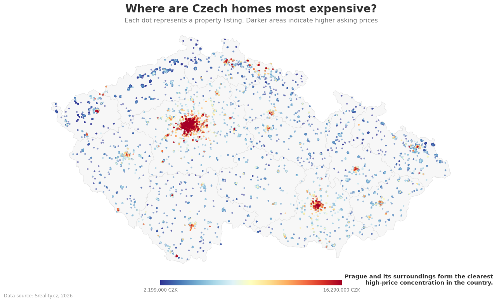
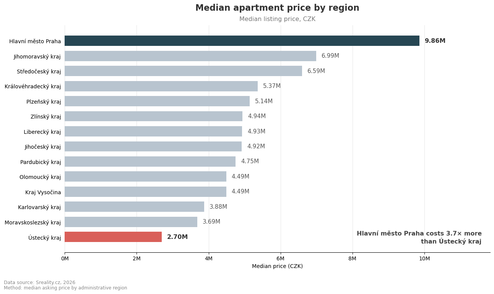
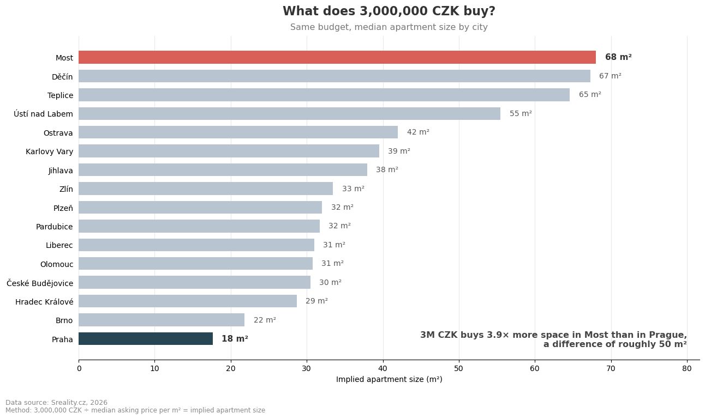
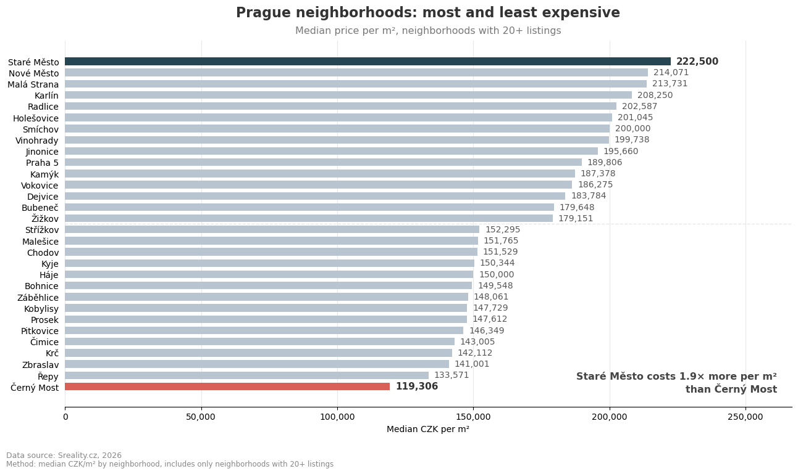
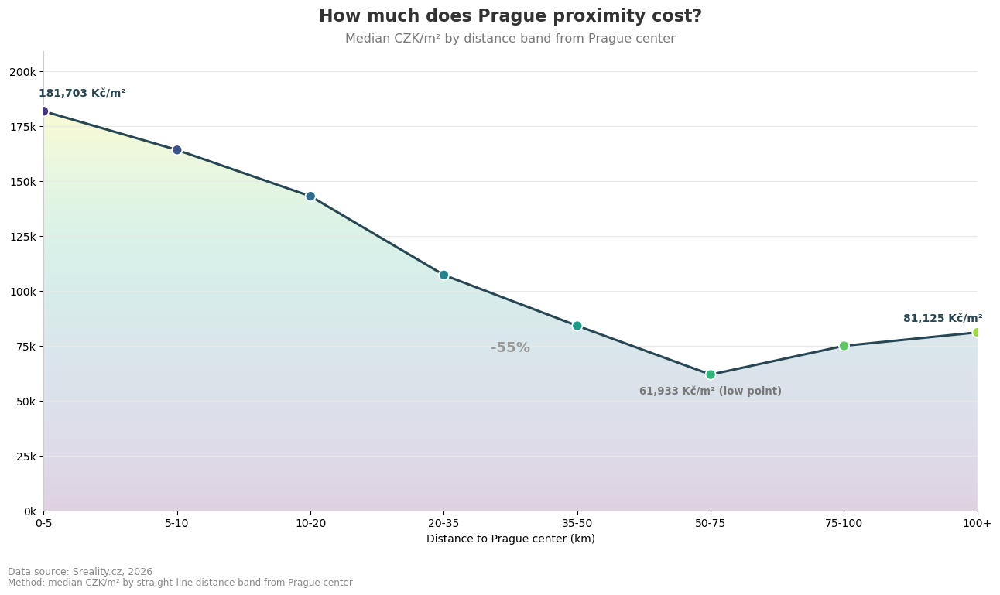
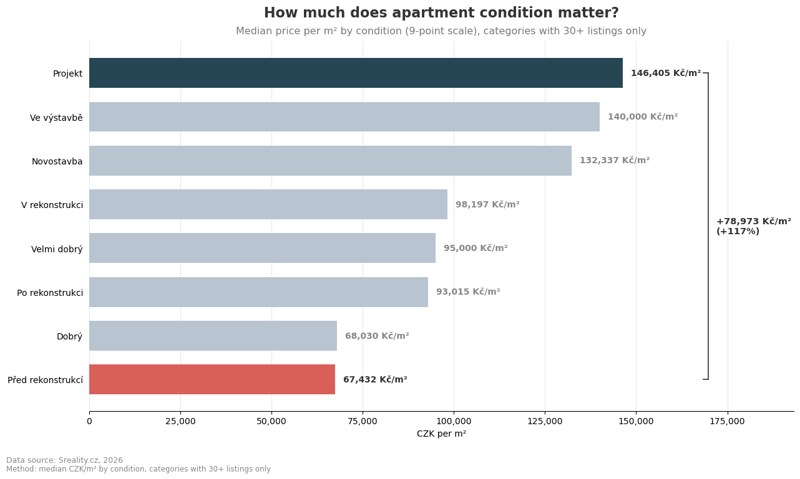
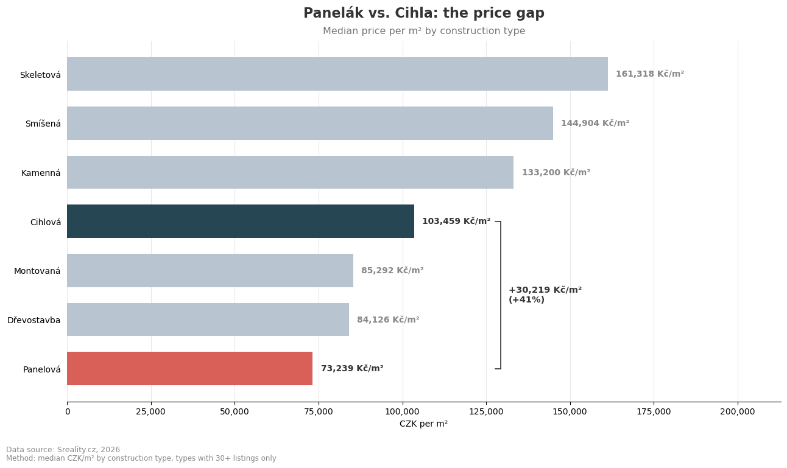
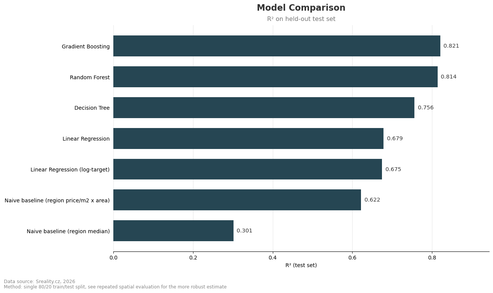
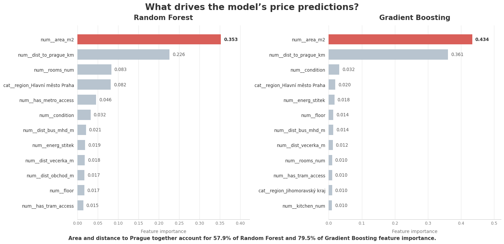

# What actually decides an apartment's price in Czechia?

**I scraped around 20,000 real apartment listings from Sreality.cz to see how much of an apartment's price you can explain without ever seeing a place. Answer: about 80%, using size, location and condition. The other 20% is everything a spreadsheet can't capture.**

> **However you got here:** the charts and bold takeaways tell the whole story on their own, skim those. Anything folded into a `▸ details` block is for people who want the methodology, the caveats or the code. Nothing important is hidden in there; it's just not required reading.

---

*Every dot is a real listing. Brighter = more expensive. Prague and Brno light up immediately, everywhere else tells a quieter story.*

## The numbers that surprised me most

- **Prague apartments cost 3.6× more** than the cheapest region (Ústecký kraj), 9.9M CZK vs. 2.75M CZK, median.
- **3,000,000 CZK buys you 18 m² in Prague or 68 m² in Most.** Same money, 3.9× the space.
- **Brick beats panel by 41%.** A "cihlová" (brick) apartment costs ~102,700 CZK/m²; a "panelová" (Communist-era prefab) one costs ~72,800 CZK/m².
- **"Coming soon" beats "already built".** Off-plan apartments still at the blueprint stage (`Projekt`) sell for *more* per m² than finished new construction (`Novostavba`), 147,000 vs. 125,844 CZK/m². More on this below; it's the single most counter-intuitive thing in the whole dataset.
- **Distance from Prague isn't a straight line down.** Price drops steadily for the first ~75 km, then ticks back *up* past 75 km, because that's far enough to start running into Brno, Ostrava and other regional cities with their own price gravity.
- Even *within* Prague, location swings price 2.2×: Staré Město (225,000 CZK/m²) vs. Dolní Měcholupy (101,250 CZK/m²).
- A tuned Random Forest explains **~80% of price variance** using only structural + location data, no photos, no agent's gut feeling. Typical miss: **~1.3M CZK** on a mid-market apartment. Good enough to be interesting, nowhere near appraisal-grade.

---

## Why I built this

Everyone in Czechia has an opinion about real estate prices. Almost nobody has looked at the actual data. I wanted to answer three questions honestly:

1. **What really drives apartment prices**: size, location, condition, or something else entirely?
2. **Can a model predict price accurately enough to be useful**, using only the kind of information you'd see in a listing?
3. **Where does the model break down** and what does that tell us about what a spreadsheet can never capture?

---

## The regional price gap is bigger than you think



Prague's median listing price (**9.9M CZK**) isn't just the highest in the country, it's **3.6× the cheapest region**, Ústecký kraj (**2.75M CZK**). That's not a gentle gradient, it's a cliff and it happens almost entirely at the Prague border.

### What the same budget actually buys

To make that concrete: here's how far **3,000,000 CZK** stretches, city by city.



In Prague, that budget buys an **18 m²** studio, barely bigger than a hotel room. In Most, the same money buys **68 m²**, a proper two-bedroom flat. Same currency, same country, 3.9× the living space.

### Even inside Prague, location isn't one price



Staré Město (Old Town) runs **225,000 CZK/m²**. Dolní Měcholupy, still technically Prague, runs **101,250 CZK/m²**, less than half. "Prague prices" isn't a single number, it's a gradient that can double before you leave the city limits.

---

## How much does Prague proximity cost?



The obvious story is here: apartments 0-5 km from Prague's center go for **181,591 CZK/m²**; apartments 100+ km away go for **81,803 CZK/m²**, a 55% drop. Distance to the capital is the second-strongest predictor in the entire model, right behind size.

But look closer and the curve isn't a straight decline, it **bottoms out around the 50-75 km mark, then rises again** past 75 km. That's not noise. It's Czechia's map talking: past a certain distance, "far from Prague" stops meaning "the middle of nowhere" and starts meaning "close to Brno, Ostrava, or another regional hub", each with its own price pull. A single "distance to Prague" number can't see that; it only knows about one city.

<details>
<summary><strong>Why this matters for the model, not just the story</strong></summary>

<br>

This is the clearest evidence in the whole project that `dist_to_prague_km` is a genuinely useful but incomplete location signal. A model using distance-to-nearest-major-city (not just distance-to-Prague) would likely pick up more of this pattern. It's on the "what's next" list below.

</details>

---

## Does "Better condition" always mean pricier? Not quite.



This is the chart that overturned my own assumption going in. I expected a clean staircase: worse condition > cheapest, `Novostavba` (new construction) > priciest. That's not what the data shows.

**The single most expensive category per m² isn't finished new construction, it's `Projekt`: apartments still being sold off-plan, before a single wall exists.** At 147,000 CZK/m², off-plan listings out-price completed new builds (125,844 CZK/m²) and even apartments currently under construction (135,509 CZK/m²). Meanwhile `Před rekonstrukcí` (needs renovation) is the cheapest surviving category at 65,139 CZK/m², but it's barely behind `Dobrý` (good condition, 67,276 CZK/m²) and both sit well below several "worse-sounding" construction-stage categories.

A few things are plausible here and I don't think it's just one of them: developers price off-plan units ambitiously since there's nothing tangible yet to negotiate against off-plan projects cluster disproportionately in already-desirable Prague developments; and buyers of pre-construction units are partly paying for optionality (choice of floor, layout, finishes) that a finished unit no longer offers. Worth treating as a real pattern, not a data error. Every category shown has several hundred to several thousand listings behind it, so this isn't a small-sample fluke.

**This is also the answer to a question the model itself raises**: `condition` is one of the *weakest* predictors in Section 7 (barely registers in feature importance), despite this chart showing real price differences. The likely reason: `condition` isn't independent of the features already doing the heavy lifting. Off-plan and new-build units cluster in the same expensive regions that `region` and `dist_to_prague_km` already capture, so once those are in the model, `condition` has little *additional* signal left to add on top. A real effect, mostly absorbed by correlated features rather than a real effect that doesn't exist.

---

## The Brick Tax



Controlling for nothing else but construction type, brick ("cihlová") buildings command a **41% premium** over prefab panel buildings ("panelová"), 102,706 vs. 72,805 CZK/m². Panel buildings still make up a huge share of Czech housing stock and the market clearly still prices in the difference decades after most of them were built.

**And the single most expensive listing in the whole dataset?** An 87,000,000 CZK, 212 m² apartment in Prague 1's Josefov quarter, roughly 1,800 average Czech monthly salaries, for one flat.

---

## The Cleaning files: What the data tried to tell us

Before any modeling, the raw listings had to survive some genuinely funny quality checks:

- A "68 m² apartment" in **Jirkov** (population ~19,000) was listed on **floor 368**. For context: the AZ Tower in Brno, Czechia's tallest building, has 30 floors total. This one would out-tower it more than 12 times over, dropped.
- An 82 m² apartment in **Poděbrady** was listed for **98,000 CZK**, about 1,195 CZK per square meter, roughly the going rate for a decent bicycle, not an apartment. Filtered out.
- A listing in **Mladá Boleslav** claimed **5,989 m²** of living space for 9.7M CZK, either a palace at bargain-basement pricing or (far more likely) a typo that turned an apartment into a small stadium. Filtered out.

None of these are edge cases worth modeling, they're data-entry mistakes. But finding them required actually looking at the data with some skepticism, not just checking for `NaN`.

---

## Can a model actually predict the price?

Short answer: **yes, mostly** and the "mostly" is the interesting part.

Seven approaches were compared: two non-ML baselines, Linear Regression (raw and log-transformed), a Decision Tree, a Random Forest and Gradient Boosting, each one fairly tuned and evaluated the same way.


*(Single train/test split, shown for quick visual comparison, the table below reports the more rigorous number.)*

| Model | R² (mean of 15 spatial splits) | Avg. Error (MAPE) |
|---|---|---|
| Naive baseline (price/m² × region area) | 0.670 | 30.4% |
| Linear Regression | 0.651 | 30.7% |
| Linear Regression (log-price) | 0.694 | 23.0% |
| Decision Tree | 0.740 | 23.5% |
| **Gradient Boosting** | **0.797** | **19.4%** |
| **Random Forest** | **0.805** | **19.3%** |

*(Every model was re-run across 15 independent geographic train/test splits and the mean is reported here, see the methodology note below for why that matters.)*

In plain terms: the best model explains **about 80% of the variation in apartment asking prices**, using size, distance to Prague, room count, condition and a handful of similar structural features. No photos, no "great natural light", no agent intuition.

What it *doesn't* do is nail the number. MAPE is an **average** error, not a bound, on a mid-market apartment (~6-7M CZK), the typical miss is around **1.3M CZK** and it's worse on expensive Prague listings, better on cheap regional ones. That's also being measured against **asking price, not confirmed sale price**, since that's what a listing scrape gives you. So: genuinely useful for showing *what drives* price and for spotting a listing that looks structurally over- or under-priced relative to comparable ones. Not something you'd want setting your final number over a professional appraisal.

### So what actually matters?



Two features dominate: **apartment size** and **distance to Prague**. Exactly how much depends on which model you ask, **Gradient Boosting concentrates 78.6% of its decision-making in these two alone; Random Forest spreads more weight elsewhere (57.7% combined), giving more credit to room count, the Prague-region flag and metro access.** Either way, everything else is a distant second act.

That's a slightly unglamorous conclusion. It's also exactly what anyone who's apartment-hunted in Czechia already suspected, which is reassuring rather than boring: the model isn't inventing a story, it's confirming one with numbers and the condition and Prague-proximity charts above show *why* the story is more textured than "bigger and closer = pricier" once you actually look.

<details>
<summary><strong> For the technically curious: how this was actually validated</strong></summary>

<br>

Real-estate data has a trap that's easy to fall into: listings cluster geographically (same building, same new-development), so a random train/test split lets a model "recognize" a location instead of generalizing to it. This project avoids that specifically:

- **Spatially grouped train/test split**, done at the level of a ~2 km grid cell (`GroupShuffleSplit`), so an entire cell is always fully train or fully test, never split between the two.
- **Grouped cross-validation**, every hyperparameter search uses `GroupKFold` on the same grid, so tuning can't benefit from the same leakage the split is designed to prevent.
- **Near-duplicate removal happens before the split, not after.** Listings sharing identical lat/lon/area/price are removed from the full dataset up front, so they can't land on both sides of a split and inflate the score.
- **VIF multicollinearity check**, confirmed `latitude`/`longitude` could safely be replaced with a single `distance_to_prague` feature without destabilizing the linear model.
- **Repeated spatial evaluation (the headline metric)**, every model was re-evaluated across **15 independent 80/20 geographic splits**, reporting mean ± standard deviation rather than trusting one lucky (or unlucky) draw.
- **Two escalating baselines**, a region-average baseline is trivial to beat; a region price-per-m² × area baseline is not. The real test is beating the second one.

Full details, code and diagnostics (residuals, coefficient stability, VIF tables) are in the [notebook](house_price_cz.ipynb).

</details>

---

## Where the model struggles

Being upfront about this matters more than the headline R²:

- **Errors grow with price.** The model is proportionally consistent, but on multi-million-CZK Prague listings, an absolute miss of 1M+ CZK is common. Structural features can't capture "unbeatable view" or "just renovated by a design studio".
- **~20% of price variation is simply invisible to this data.** No photos, no interior quality, no exact micro-location, no negotiation dynamics. That gap is the honest ceiling of what a listing scrape can ever explain.
- **Rare categories destabilize the linear model.** A handful of unusual heating types (a few dozen listings each) can swing a linear coefficient by millions of CZK, a small-sample artifact, not a real effect. The tree-based models are far more robust to this.

---

## How far could this realistically go?

Location is the biggest lever left unused. `latitude`/`longitude` are in the dataset already, they're dropped in favor of `distance_to_prague_km` for interpretability and the VIF check confirms that trade wasn't even forced by collinearity. Two ways to spend that signal more aggressively:

- **A comps-style feature**, median price/m² of the *k* nearest listings, instead of one distance-to-Prague number. This is closer to how real appraisers actually think and closer to what production AVMs lean on.
- **Distance to nearest major city, not just Prague**, directly addresses the dip-then-rise pattern found above; a Brno-proximity signal would likely explain a real chunk of the residual once you're 75+ km from Prague.
- **Leakage-safe target encoding for `district`/`city`** (out-of-fold means with shrinkage for thin categories) instead of dropping them for high cardinality.

Beyond that, in rough order of effort-to-payoff:

- **Log-target for the tree models, not just Linear Regression**, could tame the "errors grow with price" pattern directly.
- **Interaction terms** (area × region, condition × construction type), trees find some of this implicitly, but explicit engineering with more data usually surfaces it more reliably.
- **Richer features**: nearby schools/parks/noise, building age, floor-within-building context.
- **Photo-derived features**, a model scoring "renovated vs. dated" from listing photos. Most likely to move the needle a lot; also the most work by a wide margin.
- **Permutation importance / SHAP** instead of impurity-based feature importance, for more defensible claims about what matters most.
- **Time-aware validation** once listings accumulate across multiple scrape dates, to check the model holds up as the market moves.

**Realistic target with all of the above: high-80s to low-90s R², not much further.** The hard ceiling isn't modeling technique, it's the data itself: this project predicts **asking price**, not confirmed sale price. Two identical apartments listed by two different sellers can carry genuinely different asking prices, that's noise in the seller, not a property of the apartment and no amount of feature engineering removes it. Getting meaningfully past that ceiling would mean switching to sold-price data with true comparables (tax records, transaction history), which is a different, much larger data problem than anything a listing scrape can solve.

---

## Tools used

- **Python** - pandas & NumPy for cleaning and feature engineering, GeoPandas for the map, Matplotlib for every chart above
- **scikit-learn** - pipelines, `ColumnTransformer`, grouped cross-validation and all seven models
- **statsmodels** - VIF multicollinearity diagnostics
- **Jupyter Notebook** - the full analysis, end to end, in one reproducible place

## Project structure

```
├── images_and_data/
│   ├── .png                      # visualizations
│   ├── sreality_master.csv       # raw scraped listings
│   └── cz_prices_cleaned.csv     # cleaned dataset used for modeling
├── house_price_cz.ipynb          # full analysis, cleaning > modeling > diagnostics
├── house_price_prediction.ipynb  # another old analysis for synthetic data
└── README.md
```

Open the notebook and run it top to bottom every result above, including the repeated spatial evaluation, regenerates from scratch with fixed random seeds.

---

*Data: scraped from [Sreality.cz](https://www.sreality.cz), 2026. Personal identifiers (phone numbers, contact details) were removed before any analysis. This project is for portfolio/educational purposes, not financial or investment advice.*
